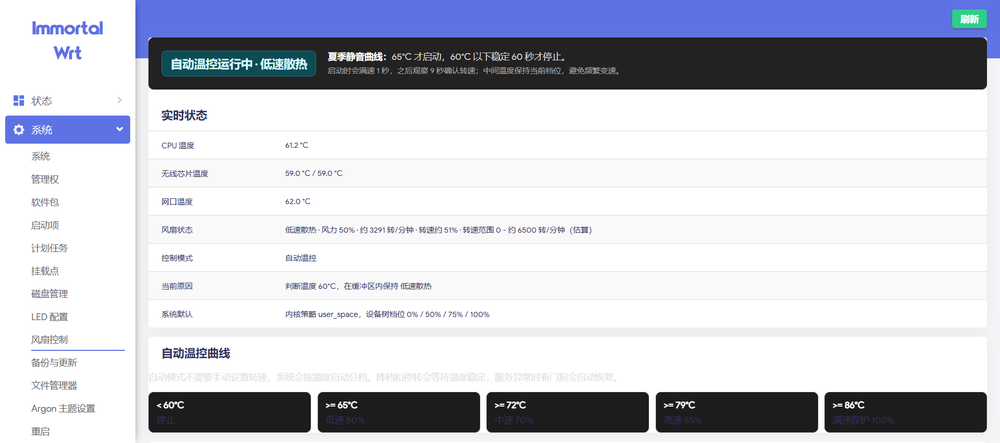
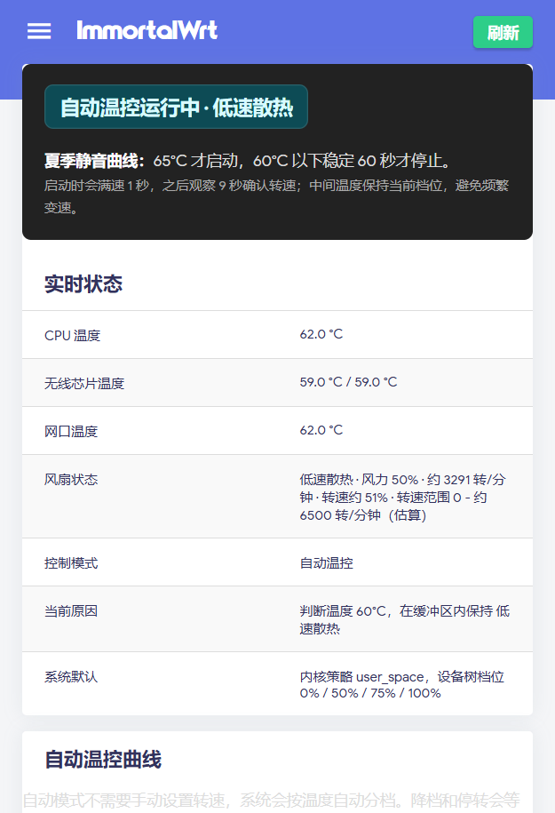

# luci-app-fancontrol

Simple LuCI fan control for GL.iNet GL-MT3600BE / Beryl 7 running
ImmortalWrt or OpenWrt-style firmware with `apk` packaging.

The package adds **System > Fan Control** to LuCI. It shows CPU temperature,
wireless and Ethernet chip temperatures, fan speed, fan speed percentage, and
the current control mode. The default installed mode is `system`, so the package
does not take over the fan until the user selects automatic or fixed control.

## Screenshots

Screenshots from GL.iNet GL-MT3600BE / Beryl 7 running ImmortalWrt 25.12 with
Argon theme:





## Features

- LuCI page under `System > Fan Control`.
- Automatic hardware discovery for `cpu_thermal`, `pwmfan`, `fan1_input`,
  `pwm1`, and thermal cooling devices.
- Three control modes:
  - `system`: leave fan control to the kernel / firmware defaults.
  - `auto`: use the built-in quiet temperature curve.
  - `fixed`: fixed fan power for short-term testing.
- Real-time status:
  - CPU temperature
  - wireless chip temperatures
  - Ethernet chip temperature
  - fan power percentage
  - fan RPM
  - estimated fan speed percentage
  - current reason / state
- Procd-managed daemon plus a lightweight watchdog.
- 1-second full-speed kick when starting from stopped state.
- RPM fault detection with per-level minimum RPM thresholds.
- Default quiet logging: normal operation does not write fancontrol logs.
- LuCI ACL and ucitrack metadata for modern OpenWrt / ImmortalWrt LuCI apply
  flows.

## Compatibility

### Tested Device

This package was developed and tested on:

| Item | Value |
| --- | --- |
| Device | GL.iNet GL-MT3600BE / Beryl 7 |
| Firmware family | ImmortalWrt 25.12 / OpenWrt-style system |
| Target | mediatek / filogic |
| Package manager | `apk` |
| Kernel fan driver | `pwm-fan` |

Expected sysfs nodes:

- CPU temperature: `/sys/class/hwmon/*/name = cpu_thermal` or
  `/sys/class/thermal/thermal_zone0/temp`
- Fan driver: `/sys/class/hwmon/*/name = pwmfan`
- Fan RPM: `fan1_input`
- PWM control: `pwm1`

### Likely Compatible Devices

Other routers may work if all of the following are true:

- The device runs OpenWrt / ImmortalWrt or a close LuCI-based firmware.
- The fan is exposed through the Linux `pwm-fan` driver.
- The system has a readable RPM node such as `fan1_input`.
- The system has a writable PWM node such as `pwm1`.
- CPU temperature is available from `cpu_thermal` or a thermal zone.

This usually means fan-equipped OpenWrt devices with a standard `pwm-fan`
sysfs layout. MediaTek Filogic devices are the most likely candidates, but this
package is not limited to Filogic if the sysfs nodes match.

### Not Suitable Without Porting

This package is not suitable as-is for:

- fanless routers;
- devices whose fan has no RPM feedback;
- devices controlled by GPIO-only on/off fan logic;
- devices using vendor-specific fan control daemons without `pwm1`;
- devices where fan sysfs paths require non-standard writes.

### Quick Compatibility Check

Run the following commands on the router:

```sh
for d in /sys/class/hwmon/hwmon*; do
  echo "$d: $(cat "$d/name" 2>/dev/null)"
  ls "$d"/fan*_input "$d"/pwm* 2>/dev/null
done

for z in /sys/class/thermal/thermal_zone*; do
  echo "$z: $(cat "$z/type" 2>/dev/null) $(cat "$z/temp" 2>/dev/null)"
done
```

If you cannot find `pwmfan`, `fan1_input`, and `pwm1`, treat the device as
unsupported until it is ported and tested.

## Default Fan Strategy

Automatic mode uses a summer quiet curve:

| Temperature | Fan state |
| --- | --- |
| `< 60°C` | stopped |
| `>= 65°C` | low, 50% |
| `>= 72°C` | medium, 70% |
| `>= 79°C` | high, 85% |
| `>= 86°C` | full-speed protection, 100% |

Downshift and stop hysteresis:

| Transition | Requirement |
| --- | --- |
| low -> stopped | `<= 60°C` stable for 60 seconds |
| medium -> low | `<= 68°C` stable for 45 seconds |
| high -> medium | `<= 75°C` stable for 45 seconds |
| full -> high | `<= 82°C` stable for 30 seconds |

Additional protection:

- Fan starts with a 1-second 100% kick, then drops to the target level.
- Startup RPM checks are delayed for 9 seconds to avoid false failures while the
  sensor catches up.
- Temperature is smoothed over the latest 3 samples.
- Polling interval is 3 seconds.
- Once started, the fan must run for at least 60 seconds before stopping.

RPM fault thresholds:

| Level | Minimum RPM before fault confirmation |
| --- | --- |
| low | 500 RPM |
| medium | 700 RPM |
| high | 900 RPM |
| full | 1000 RPM |

The fault must be seen 3 times in a row before entering full-speed protection.

## Fan Speed Percentage

The UI shows both fan power and fan speed:

- `fan power`: PWM percentage written to the fan driver.
- `fan speed`: current RPM divided by an estimated maximum RPM.

The default maximum RPM estimate is `6500 RPM`. This is not an official hardware
rating. If a higher RPM is observed during runtime, the daemon uses the observed
peak for display until the service restarts.

## Logging

Fancontrol is quiet by default. Normal polling, normal watchdog checks, and
normal level changes do not write syslog entries.

Debug logging can be enabled temporarily by creating:

```sh
touch /tmp/fancontrol.debug
```

Disable it again with:

```sh
rm -f /tmp/fancontrol.debug
```

Runtime state is stored under `/var/run`, which is memory-backed on OpenWrt-like
systems.

## Build

Place this package under an OpenWrt / ImmortalWrt package feed or package tree,
then build it with the normal SDK workflow.

Example:

```sh
make package/luci-app-fancontrol/compile V=s
```

The package is marked as `PKGARCH:=all`.

## Manual Deployment For Testing

For quick testing on a router, copy the `root/` contents to the target system:

```sh
scp -r root/* root@<router-ip>:/
ssh root@<router-ip>
chmod +x /usr/bin/fancontrol /etc/init.d/fancontrol
/etc/init.d/rpcd reload
/etc/init.d/ucitrack restart
/etc/init.d/fancontrol enable
/etc/init.d/fancontrol restart
rm -rf /tmp/luci-*
```

Then open LuCI and go to `System > Fan Control`.

## Useful Commands

```sh
/usr/bin/fancontrol status
/usr/bin/fancontrol apply
/usr/bin/fancontrol system
/etc/init.d/fancontrol restart
logread -e fancontrol
```

## Safety Notes

- The default mode is `system`; the package does not take over fan control until
  automatic or fixed mode is selected.
- Fixed mode is intended for short-term testing only.
- Fan control touches hardware sysfs nodes. Verify compatibility before using it
  on devices other than GL-MT3600BE.
- The author and contributors are not responsible for hardware damage caused by
  incorrect firmware, incompatible hardware, or unsafe manual changes.

## License

MIT. See [LICENSE](LICENSE).
